# kbox Hardware Setup Guide

This guide explains how to set up kbox with different hardware configurations, from simple single-room setups to more elaborate home theater systems.

## Understanding Karaoke Audio

A karaoke system combines two audio sources:

1. **Backing Track** - The instrumental music (from YouTube videos in kbox's case)
2. **Vocals** - The singer's voice through a microphone

These two signals need to be **mixed together** before going to speakers. The mix balance matters: vocals should be audible over the music, but not so loud they overpower it.

```mermaid
flowchart LR
    subgraph Sources
        BT[🎵 Backing Track]
        MIC[🎤 Microphone]
    end
    
    subgraph Mixing
        MIX((Mix))
    end
    
    subgraph Output
        SPK[🔊 Speakers]
    end
    
    BT --> MIX
    MIC --> MIX
    MIX --> SPK
```



### Audio Channels Explained

| Channel | Source | Typical Processing |
|---------|--------|-------------------|
| Backing Track | kbox (YouTube audio) | Pitch shifting, volume control |
| Vocals | Microphone | Preamp gain, reverb/echo, volume control |
| Main Output | Mixed signal | Master volume, sent to speakers/amplifier |

### Where Mixing Happens

The mixing can happen in different places:

- **Hardware mixer** - A dedicated mixing board (like Mackie ProFX)
- **Audio interface** - Using direct monitoring (like Scarlett Solo)
- **Software** - Inside kbox itself (Phase 2 feature, not yet implemented)

## What kbox Does (and Doesn't Do)

### kbox Provides

- ✅ YouTube karaoke video search and playback
- ✅ Song queue management via web interface
- ✅ Video output (HDMI) with lyrics display
- ✅ Audio output of backing tracks
- ✅ Real-time pitch shifting of backing tracks
- ✅ QR code overlay for easy queue access

### kbox Does NOT Provide (Currently)

- ❌ Microphone input or processing
- ❌ Audio mixing (mic + backing track)
- ❌ Reverb/echo effects on vocals
- ❌ Wireless microphone receivers

**You need external hardware** to handle microphone input and mix it with kbox's audio output.

---

## Simple Setup: Scarlett Solo

This is the most accessible setup for casual karaoke. It uses a USB audio interface to handle both audio output and microphone mixing.

### What You Need

| Item | Example | Purpose |
|------|---------|---------|
| Computer | Raspberry Pi 5, laptop, or mini PC | Runs kbox |
| Display | Any HDMI monitor/TV | Shows lyrics |
| Audio Interface | Focusrite Scarlett Solo (3rd gen) | Mixes mic + audio |
| Microphone(s) | Wired XLR mic, or wireless system (see below) | Vocals |
| Powered Speaker | JBL, QSC, or similar powered speaker | Sound output |
| 1/4" TRS Cable | Standard balanced audio cable | Interface to speaker |

### How It Works

The Scarlett Solo's **Direct Monitor** feature mixes your microphone with the USB audio from kbox, all in hardware with zero latency.

```mermaid
flowchart TB
    subgraph kbox["kbox (Raspberry Pi / Computer)"]
        SW[kbox Software]
    end
    
    subgraph solo["Scarlett Solo"]
        DM[Direct Monitor Mix]
    end
    
    MIC[🎤 Microphone] -->|XLR| solo
    kbox -->|USB Audio| solo
    kbox -->|HDMI| MON[🖥️ Display]
    solo -->|1/4 inch TRS| SPK[🔊 Powered Speaker]
    
    style DM fill:#e1f5fe
```



### Setup Steps

1. **Connect the Scarlett Solo to your computer via USB**
   - The Solo will appear as an audio device

2. **Disable MSD Mode (Linux only - IMPORTANT!)**
   
   The Scarlett Solo 3rd gen ships with "MSD Mode" (Mass Storage Device mode) enabled by default. This mode is meant for initial setup on Windows/Mac but causes **distorted/clipped audio on Linux**.
   
   Check if MSD mode is on:
   ```bash
   amixer -c USB sget 'MSD Mode'
   ```
   
   If it shows `[on]`, disable it:
   ```bash
   amixer -c USB sset 'MSD Mode' off
   ```
   
   **Then unplug and replug the Scarlett Solo.** The mode change only takes effect after re-enumeration.
   
   > **Note**: This setting persists in the Scarlett's firmware - you only need to do this once.

3. **Configure kbox to use the Scarlett as audio output**
   - On Raspberry Pi, find the device name:
     ```bash
     aplay -l
     ```
   - Look for the Scarlett (usually `hw:CARD=USB` or similar)
   - Set `audio_output_device` in kbox config to `plughw:CARD=USB,DEV=0`
   
   > **Tip**: Use `plughw:` (not `hw:`) to let ALSA handle sample format conversion automatically.

4. **Connect your microphone(s)**

   **Option A: Single wired mic** → use **Input 1** (XLR)
   - Plug XLR cable from your mic into Input 1 (the combo jack)
   - If using a condenser mic, press the **48V** button for phantom power
   - Dynamic mics (SM58, XM8500) don't need phantom power
   
   **Option B: Wireless mic system** → use **Input 2** (1/4" line)
   - Connect receiver's 1/4" output to Input 2 using a 1/4" TS cable
   - Leave the **INST** button OFF (wireless receivers output line level)
   - This works great for dual-mic systems like the TONOR TW-820
   
   > **Why different inputs?** Input 1 has a mic preamp for low-level XLR signals. Input 2 expects line-level signals - wireless receivers already have internal preamps, so using Input 1 would double-amplify and cause distortion.

5. **Enable Direct Monitor**
   - Flip the Direct Monitor switch to ON (front panel)

6. **Connect speaker**
   - Run 1/4" TRS cable from Solo's output to your powered speaker

7. **Connect display**
   - HDMI from computer to your monitor/TV

8. **Balance the mix**
   - **Mic level**: Adjust the gain knob for your input while singing:
     - *Wired mic (Input 1)*: Use the large **Input 1 Gain** knob on top
     - *Wireless (Input 2)*: Use the smaller **Input 2 Gain** knob on top
     - Watch the LED ring: green = good, yellow = okay, red = too hot (clipping)
   - **Music level**: Adjust in kbox web UI (YouTube volume slider)
   - **Overall level**: Use the **Monitor** knob to control output to speakers/headphones

### Microphone Options

#### Option A: Single Wired Microphone

The simplest setup - one XLR mic into Input 1.

```mermaid
flowchart TB
    subgraph kbox["kbox (Raspberry Pi / Computer)"]
        SW[kbox Software]
    end
    
    subgraph solo["Scarlett Solo"]
        DM[Direct Monitor Mix]
    end
    
    MIC[🎤 Wired Mic] -->|XLR| solo
    kbox -->|USB Audio| solo
    kbox -->|HDMI| MON[🖥️ Display]
    solo -->|1/4 inch TRS| SPK[🔊 Powered Speaker]
    
    style DM fill:#e1f5fe
```



**Recommended wired microphones:**
- **Budget**: Behringer XM8500 (~$20) - dynamic, no phantom power needed
- **Mid-range**: Shure SM58 (~$100) - industry standard, very durable
- **Condenser**: Audio-Technica AT2020 (~$100) - requires 48V phantom power

#### Option B: Wireless Microphone System

For two singers, use a wireless system with a combined output into Input 2.

```mermaid
flowchart TB
    subgraph wireless["Wireless Mic System"]
        MIC1[🎤 Mic 1]
        MIC2[🎤 Mic 2]
        RX[Receiver]
    end
    
    subgraph solo["Scarlett Solo"]
        DM[Direct Monitor Mix]
    end
    
    MIC1 -.->|wireless| RX
    MIC2 -.->|wireless| RX
    RX -->|1/4 inch| solo
    
    subgraph kbox["kbox"]
        SW[Software]
    end
    
    kbox -->|USB Audio| solo
    kbox -->|HDMI| MON[🖥️ Display]
    solo -->|1/4 inch TRS| SPK[🔊 Speaker]
    
    style DM fill:#e1f5fe
```



**Recommended wireless system:**
- [TONOR TW-820](https://www.amazon.com/dp/B07RJLKBRD) (~$100) - 2 handheld mics, UHF, ~200ft range, individual volume controls on receiver

### Limitations

- **No reverb** - Dry vocal sound (some find this acceptable for casual use)
- **No per-channel EQ** - Can't shape vocal tone (a mixer provides this)

> **Note**: You can adjust the mix balance between vocals and backing track using the Input 2 gain knob (for wireless) or Input 1 gain knob (for wired mic). The USB playback level is controlled via kbox's volume setting.

### Balancing Levels (Gain Staging)

With multiple volume controls in the signal chain, it's important to set each one correctly. The goal is to get a strong, clean signal at each stage without clipping.

**The signal chain:**
```
Wireless Mic → Receiver → Solo Input 2 → Solo Monitor Mix → Speaker/Amp
                                    ↑
kbox → USB Audio ─────────────────────┘
```

**Step-by-step level setup:**

1. **Speaker/Amp: Start at low volume**
   - Turn your powered speaker or amp to ~25% volume
   - This protects your ears while you adjust upstream levels

2. **kbox: Set to moderate level**
   - In the kbox web UI, set YouTube volume to **0.7-0.8** (70-80%)
   - This leaves headroom for the Solo to mix without clipping

3. **Solo Monitor knob: Set to 12 o'clock**
   - This controls the overall output level (headphones + line out)
   - Start at the middle position

4. **Start a backing track in kbox**
   - Queue a song and let it play
   - You should hear it through the speakers at a comfortable level
   - If too quiet/loud, adjust the **speaker/amp volume** (not the Solo yet)

5. **Wireless receiver: Set individual mic levels**
   - Have each singer speak/sing into their mic at performance level
   - Adjust each mic's level on the receiver so the signal is strong but not clipping
   - Most receivers have LED indicators - aim for green, occasional yellow, no red

6. **Solo Input 2 gain: Match mic level to backing track**
   - While the backing track plays, have someone sing
   - Adjust the Input 2 gain knob until vocals sit nicely with the music
   - Vocals should be clearly audible but not overpower the track

7. **Final balance adjustments:**
   - **Vocals too quiet overall?** Turn up Solo Input 2 gain
   - **Backing track too quiet?** Increase kbox volume or Solo Monitor knob
   - **Everything too quiet?** Turn up speaker/amp
   - **Clipping/distortion?** Reduce the level at the stage where it's occurring

**Quick reference - what each control does:**

| Control | Location | Affects |
|---------|----------|---------|
| Mic volume knobs | Wireless receiver | Individual mic levels before they reach the Solo |
| Input 2 gain | Scarlett Solo (top) | Mic input level into the Solo's mix |
| Monitor knob | Scarlett Solo (front) | Overall output level (headphones + line out) |
| YouTube volume | kbox web UI | Backing track level sent to Solo via USB |
| Speaker volume | Powered speaker/amp | Final output loudness |

> **Tip**: If you're getting distortion, work backwards through the chain to find where it's happening. Each stage should have a clean signal - if one stage is too hot, reduce it there rather than compensating downstream.

---

## Advanced Setup: Mixer + Home Theater

This setup uses a hardware mixer for full audio control with effects, an A/V receiver for amplification, and dual displays (projector for audience, monitor for performer).

The key component is an **HDMI Audio Injector** (also called an "embedder") - it replaces the Pi's HDMI audio with the mixer's output, so the receiver gets a single HDMI signal containing both video and the fully mixed audio.

### What You Need

| Item | Example | Purpose |
|------|---------|---------|
| Computer | Raspberry Pi 5 | Runs kbox |
| Mixer with USB | Mackie ProFX6v3 or similar | Audio mixing with built-in effects |
| HDMI Splitter | 1-in-2-out | Sends video to both displays |
| HDMI Audio Injector | Monoprice Blackbird, J-Tech Digital, or similar | Replaces HDMI audio with mixer output |
| A/V Receiver | Denon, Yamaha, etc. | Amplifies audio, routes video |
| Projector | Ultra-short-throw recommended | Main display (audience-facing) |
| Monitor | Any HDMI monitor | Confidence monitor (performer-facing) |
| Microphones | Dynamic mics (SM58 or similar) | Vocals (mixer supports multiple) |
| Speakers | Connected to A/V receiver | Main sound output |

### Signal Flow

```mermaid
flowchart TB
    subgraph pi["Raspberry Pi"]
        KBOX[kbox]
    end
    
    subgraph video["Video Path"]
        SPLIT[HDMI Splitter]
        INJ[HDMI Audio Injector]
    end
    
    subgraph audio["Audio Path"]
        MIX[Mixer]
    end
    
    subgraph outputs["Outputs"]
        RX[A/V Receiver]
        PROJ[📽️ Projector<br/>Audience Display]
        MON[🖥️ Monitor<br/>Performer Display]
        SPK[🔊 Speakers]
    end
    
    MIC1[🎤 Mic 1] --> MIX
    MIC2[🎤 Mic 2] --> MIX
    
    KBOX -->|USB Audio| MIX
    KBOX -->|HDMI| SPLIT
    
    SPLIT -->|HDMI 1| INJ
    SPLIT -->|HDMI 2| MON
    
    MIX -->|Analog Audio| INJ
    INJ -->|HDMI with mixed audio| RX
    
    RX -->|HDMI| PROJ
    RX -->|Speaker Wire| SPK
    
    style MIX fill:#fff3e0
    style INJ fill:#e8f5e9
    style RX fill:#e3f2fd
```



### How It Works

1. **Video splits two ways:**
   - One copy goes to the HDMI Audio Injector → Receiver → Projector (audience sees this)
   - Other copy goes directly to confidence monitor (performer sees this)

2. **Audio flows through the mixer:**
   - Pi sends backing track to mixer via USB
   - Microphones connect to mixer with full EQ and effects
   - Mixer's main output feeds the HDMI Audio Injector

3. **HDMI Audio Injector combines them:**
   - Takes video from the Pi (via splitter)
   - Strips the original HDMI audio
   - Injects the mixer's audio output instead
   - Sends combined signal to A/V receiver

4. **A/V Receiver handles the rest:**
   - Decodes and amplifies audio to speakers
   - Passes video through to projector

### Mixer Advantages

- **Multiple microphones** - Most mixers have 2-6+ mic inputs
- **Built-in effects** - Reverb, delay, compression on vocals
- **Per-channel EQ** - Shape each voice independently
- **Precise level control** - Faders for exact balance
- **Headphone monitoring** - Preview mix without affecting main output
- **USB audio class compliant** - No drivers needed on Pi

### Setup Steps

#### 1. Connect Pi to Mixer (USB)

The mixer appears as a USB audio device. Find its name:

```bash
aplay -l
```

Look for your mixer (e.g., `hw:CARD=ProFX6v3`). Set this as `audio_output_device` in kbox config.

#### 2. Connect Pi to HDMI Splitter

- HDMI cable from Pi to splitter input
- Splitter output 1 → HDMI Audio Injector
- Splitter output 2 → Performer's confidence monitor

#### 3. Set Up the HDMI Audio Injector

- HDMI input: From splitter (carries Pi's video)
- Audio input: From mixer's main output (usually 1/4" TRS or RCA)
- HDMI output: To A/V receiver

The injector strips the Pi's audio and replaces it with the mixer output.

#### 4. Connect Microphones to Mixer

- Plug mics into mixer's XLR inputs
- If using a wireless system (like TONOR TW-820), use the **dual XLR outputs** from the receiver - this gives each mic its own mixer channel for independent control
- Set gain for each mic (green signal, no red clipping)
- Dial in EQ and effects to taste
- Assign to main mix

#### 5. Configure A/V Receiver

- HDMI input from injector
- Assign that input to your karaoke source
- Route video output to projector
- Configure speakers as normal

#### 6. Balance the Mix

On the mixer:
- **USB channel** (backing track): Set to appropriate level
- **Mic channels**: Set levels relative to backing track
- **Effects sends**: Add reverb to taste on vocal channels
- **Main fader**: Control overall volume

### Room Layout

```
┌─────────────────────────────────────────────────────────┐
│                    BACK OF ROOM                         │
│                                                         │
│   ┌───────────────────────────────────────────────┐     │
│   │              PROJECTION SCREEN                │     │
│   │          (ultra-short-throw projector)        │     │
│   └───────────────────────────────────────────────┘     │
│                                                         │
│   🔊 Speaker                              Speaker 🔊    │
│                                                         │
├─────────────────────────────────────────────────────────┤
│                                                         │
│                    🎤 PERFORMER 🎤                       │
│                    (facing audience)                    │
│                                                         │
│              ┌──────────────────────┐                   │
│              │  CONFIDENCE MONITOR  │                   │
│              │   (facing performer) │                   │
│              └──────────────────────┘                   │
│                                                         │
├─────────────────────────────────────────────────────────┤
│                                                         │
│                      AUDIENCE                           │
│                    (facing screen)                      │
│                                                         │
└─────────────────────────────────────────────────────────┘
```

### Why This Setup?

| Benefit | Explanation |
|---------|-------------|
| **Single cable to receiver** | HDMI carries both video and mixed audio |
| **Full effects** | Mixer provides reverb, EQ, compression |
| **Multiple mics** | Support duets or group singing |
| **Dual displays** | Audience sees screen, performer sees monitor |
| **Clean integration** | Works with existing home theater setup |
| **Professional sound** | Proper gain staging and mixing control |

---

## Troubleshooting

### No audio from kbox

1. Check `audio_output_device` setting in kbox config
2. Run `aplay -l` to verify the device is recognized
3. Test with `speaker-test -D plughw:CARD=USB -c 2`

### Distorted/clipped audio on Scarlett Solo (Linux)

This is almost always caused by **MSD Mode** being enabled. The Scarlett Solo 3rd gen ships with this mode on by default.

1. Check MSD mode: `amixer -c USB sget 'MSD Mode'`
2. If it shows `[on]`, disable it: `amixer -c USB sset 'MSD Mode' off`
3. **Unplug and replug the Scarlett** - the change requires re-enumeration
4. Test again: `aplay -D plughw:CARD=USB,DEV=0 /usr/share/sounds/alsa/Front_Center.wav`

This setting persists in firmware - you only need to do it once.

### Microphone too quiet

1. Turn up the Gain knob on your interface/mixer
2. Make sure phantom power is on if using a condenser mic
3. Check that Direct Monitor is enabled (Scarlett Solo)

### Audio delay/latency

- Use Direct Monitor (bypasses computer processing)
- If using software monitoring, reduce buffer size
- Hardware mixing always has lower latency than software

### Video not displaying

1. Check HDMI connection
2. Try a different HDMI cable
3. Verify display is set to correct input

---

## Hardware Recommendations

### Budget/Simple Setup (~$200-300)
- Focusrite Scarlett Solo 3rd Gen (~$130)
- Behringer XM8500 dynamic mic (~$20)
- XLR cable (~$10)
- Powered speaker (JBL, QSC, similar ~$100-150)

### Mixer Setup (~$400-600)
- Mackie ProFX6v3 mixer with USB (~$200)
- Shure SM58 microphone (~$100)
- Powered PA speakers pair (~$200-300)

### Full Home Theater Setup (~$600+ plus existing A/V gear)
- Mackie ProFX6v3 or similar USB mixer (~$200)
- HDMI splitter 1x2 (~$20)
- HDMI Audio Injector/Embedder (~$50-60)
- Microphones - wired SM58 (~$100) or wireless system (~$200+)
- Confidence monitor - any small HDMI display (~$100-150)
- *Uses existing*: A/V receiver, speakers, projector/TV

### HDMI Audio Injector Notes

An HDMI audio injector (or "embedder") takes an HDMI video signal and replaces its audio track with an external audio source. Look for one that supports:
- 4K passthrough (if your display supports it)
- HDCP 1.2+ (required for most HDMI devices)
- Both optical (TOSLINK) and analog (3.5mm or RCA) audio inputs

The [Monoprice Blackbird 4K HDMI Audio Inserter](https://www.amazon.com/dp/B01B5FR7PY) is a solid choice (~$50-60), though availability varies. Similar devices from J-Tech Digital and others work equally well.

### Recommended Brands

| Category | Budget | Mid-Range | Premium |
|----------|--------|-----------|---------|
| **Mixer** | Behringer Xenyx | Mackie ProFX | Yamaha MG |
| **Wired Dynamic Mic** | Behringer XM8500 (~$20) | Shure SM58 (~$100) | Sennheiser e835 |
| **Audio Interface** | Behringer UMC22 | Focusrite Scarlett Solo (~$130) | Universal Audio Volt |
| **Wireless Mic System** | TONOR TW-820 (~$100) | Shure BLX (~$300) | Sennheiser EW-D |

### Wireless Microphone Systems

For karaoke, a dual wireless system is often more practical than wired mics - no cables to trip over, and singers can move freely.

The [TONOR TW-820](https://www.amazon.com/dp/B07RJLKBRD) (~$100-110) is a great budget option:
- 2 metal handheld wireless mics
- UHF with 15 selectable frequencies (avoids interference)
- ~200ft range
- Individual volume controls for each mic on the receiver
- Combined 1/4" output (for simple setups) OR dual XLR outputs (for mixers)
- Runs on AA batteries

For the **Simple Setup** (Scarlett Solo): Use the combined 1/4" output into the Solo's instrument input.

For the **Advanced Setup** (Mixer): Use the dual XLR outputs so each mic gets its own channel with independent EQ and effects.

