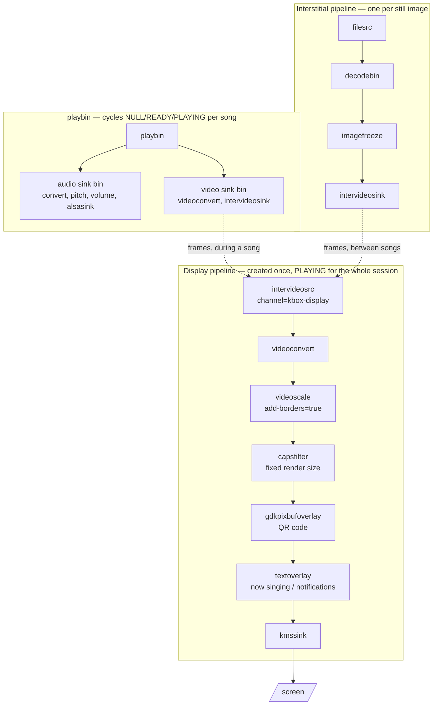

# The GStreamer Pipeline

How kbox gets audio and video onto a screen, why it is arranged this way, and
the things that look like they should work but do not.

Read this before changing anything in `kbox/streaming.py`. Most of the notes
below exist because something plausible was tried, shipped, and had to be
measured on real hardware before it became obvious it was wrong.

## The shape of it

Three pipelines, not one.



**The display pipeline owns the screen.** It goes to PLAYING once at startup
and stays there until the process exits. Nothing about a song change touches
it.

**playbin decodes songs** and renders into an `intervideosink`, which hands
buffers to the display pipeline's `intervideosrc` over a named channel. It is
free to cycle through NULL and READY as often as it likes.

**A separate pipeline feeds still images.** Interstitials (idle screen,
"up next", end of queue) are PNGs, and go through `imagefreeze` rather than
playbin.

playbin and the interstitial pipeline are **mutually exclusive** — each stops
the other before it starts feeding. If both fed the bridge at once, a song and
an interstitial would interleave on screen.

## Why kmssink, despite gstreamer-plugins-bad

kmssink ships in gstreamer-plugins-bad, which sometimes reads as a quality
warning. It isn't one — "bad" means the module hasn't accumulated enough
review, tests, or wide use to get promoted, not that it's poorly maintained.
kmssink has an active maintainer and sees regular patches, and it's the
backend other kiosk/signage software (e.g. Kodi's GBM output) relies on too.

The alternatives all give up something kbox needs:

- **waylandsink** — also lives in plugins-bad, so no maturity gain, and it
  requires a compositor process (weston/cage/labwc) running alongside kbox.
- **glimagesink** (EGL/GBM) — in plugins-base, but does its scaling on the
  GPU via GL rather than the display controller's overlay plane. See "kmssink
  already scales in hardware" below for why that plane scaling is
  load-bearing for frame rate.
- **X11 + ximagesink/xvimagesink** — in plugins-base, but needs a full X
  server running just to show one fullscreen video.

Net: every alternative either shares kmssink's plugins-bad status or trades
away the hardware plane scaling this pipeline's frame budget depends on.
Revisit only if kmssink itself becomes a concrete blocker (a specific bug,
missing feature), not because of the module it ships in.

## How it used to work, and why it changed

The first generation put everything in one playbin:

```
playbin
  ├── audio-sink: audioconvert → pitch shift → volume → alsasink
  └── video-sink: videoconvert → overlays → videoscale → kmssink
```

Interstitials were played *through playbin* by pointing its `uri` at a PNG.

This had two visible faults, filed as
[#94](https://github.com/mdz/kbox/issues/94) and
[#93](https://github.com/mdz/kbox/issues/93):

**The console flashed between songs.** playbin owns whatever is set as its
`video-sink`, so every song change dragged kmssink through PAUSED→READY.
`GstBaseSink.stop()` runs on that transition, and for kmssink it closes the DRM
file descriptor — dropping DRM master and handing the screen back to the
kernel console, `getty` prompt and all.

The fix is the split above: the sink's *lifetime* has to be independent of the
content being played. Nothing else works, because the problem is not which
state playbin drops to (see the traps below).

**The console showed in the margins of non-16:9 videos.** kmssink scales to
fit *while preserving aspect*, so a 4:3 source on a 16:9 screen lands centred
with bars either side, and the console is what is underneath. The fix is to
letterbox the source into a frame that already carries the display's aspect
ratio, so the frame kmssink scales covers the screen.

## Why the render size is fixed and capped

The `capsfilter` after `videoscale` pins every frame to one size for the whole
session — the display's aspect ratio, capped at `MAX_RENDER_HEIGHT` (720).
Both halves of that matter.

**Fixed**, because kmssink allocates DRM framebuffers for one frame size and
cannot reallocate them when caps change underneath it. Letting the frame size
follow the source produces `failed to activate bufferpool`, then an internal
data stream error, then a pipeline that renders nothing at all while the
console sits on screen. Adding a `queue` does not help; the constraint is
kmssink's, not a threading problem.

**Capped**, because software scaling to the display's full resolution is too
expensive to keep up. Measured on a Pi 5, 640x360 source at 30fps:

| render size | cost | sustained frame rate |
|---|---|---|
| 1920x1080 | ~46 ms/frame | 23.6 fps — drops 21% of frames |
| 1280x720 | ~25 ms/frame | 30.0 fps |
| 960x540 | ~16 ms/frame | 30.0 fps |

Rendering smaller costs nothing in quality: kmssink's upscale is free, and
sources at or below the render height pass through `videoscale` untouched.
Raising the cap to the display's resolution reintroduces frame drops, so treat
it as load-bearing rather than a tuning preference.

## Overlays

The QR code and notification text are composited **after** the capsfilter, in
the fixed render frame:

- Its top-left corner is the screen's top-left, even when the video is inset
  between bars — so the QR sits in the bar rather than on top of the video.
- kmssink scales the whole frame by one factor, so anything sized as a
  *proportion* of the render frame is a constant size on screen.

Upstream of the scaler they would be drawn onto the source frame and magnified
along with it. A QR sized for a 1080p screen drawn on a 360-line video is
about 45% of its height, and stays that big once scaled up.

## Measuring changes

The display pipeline is on the hot path for every frame.
`test/test_pipeline_benchmark.py` measures the stages, building its pipelines
from the same `StreamingController` methods the app uses (see the file's
docstring) so it can't quietly drift from what actually runs:

```bash
# on the Pi, inside the container — the only numbers that mean anything
docker-compose exec kbox python3 -m pytest test/test_pipeline_benchmark.py -m benchmark -s

# on a macOS dev machine
contrib/with-gstreamer.sh uv run pytest test/test_pipeline_benchmark.py -m benchmark -s

# run it directly for custom sizes, framerates, or a longer audio run
contrib/with-gstreamer.sh uv run python test/test_pipeline_benchmark.py --source 640x480 --screen 1920x1080 --fps 25
```

Its headline metric is the frame rate a configuration could sustain, not CPU
percentage, and that choice is deliberate — see the trap about it below.

## Traps

Each of these cost at least one round of deploy-and-look-at-the-screen.

### NULL versus READY makes no difference to the sink

`GstBaseSink.stop()` runs on the **PAUSED→READY** transition, not on NULL. A
sink inside playbin is torn down either way, so dropping to READY instead of
NULL to "keep the sink alive" does nothing at all. The sink's lifetime is what
matters, which is why it lives in its own pipeline.

### `intervideosrc`'s `timeout` does not hold the last frame

Its description — *"Timeout after which to start outputting black frames"* —
reads like a hold duration. It is not. Measured hold length is identical at
1 second, 5 seconds and a year: `intervideosrc` serves a received buffer a
couple of times and then generates black regardless. The property governs
waiting for a *first* buffer.

Consequence: **something must keep feeding the bridge** or the screen goes
black. That is the entire reason interstitials have their own `imagefreeze`
pipeline.

### playbin does not insert `imagefreeze` for still images

A still image decoded on its own yields one buffer and then EOS. Playing a PNG
through playbin therefore starves anything downstream.

This worked in the first generation only by accident: kmssink was inside
playbin and went on scanning out its last framebuffer after EOS. That
persistence disappeared the moment the sink moved to its own pipeline, and the
idle screen started blanking to black a second after every stop.

### `inter` elements only pair up inside one process

`intervideosink` and `intervideosrc` find each other through a process-global
registry. Two separate `gst-launch-1.0` processes **never connect** — both
pipelines run happily and exit 0, the receiver quietly emitting black frames
the whole time.

Any test of the bridge has to build both pipelines in a single process.
Otherwise it will appear to pass while testing nothing.

### kmssink already scales in hardware

It is easy to assume the sink needs to be handed screen-sized frames. It does
not. With plain defaults on a Pi 5 (`vc4-drm`), given a 640x360 frame on a
1920x1080 screen, kmssink logs:

```
drmModeSetPlane at (0,0) 1920x1080 sourcing at (0,0) 640x360
```

Upscaling in software before the sink duplicates work the display controller
does for free, at ~46 ms/frame. Only the *aspect ratio* of the frame needs
fixing, not its resolution.

Useful when investigating: `GST_DEBUG=kmssink:7` prints the plane rectangle it
actually programs, which beats guessing from what the screen looks like.

### `textoverlay` already scales its own font

`auto-resize` is on by default and scales the font relative to a 640-pixel-wide
frame. Setting a font size derived from the display scales it a second time —
on a 1080p screen that turned `Sans 9` into roughly 66pt of text across most of
the width.

Leave the font alone and let `auto-resize` do it. `xpad`/`ypad` are raw pixels
that `auto-resize` does *not* touch, so those do need scaling by hand.

### CPU percentage hides frame drops

A configuration that cannot keep up does not report 100% CPU — it drops frames
and reports something comfortable. This branch sat at ~52% while dropping a
fifth of its frames, and the deficit was invisible on screen because karaoke
content is mostly a lyric highlight sweeping over a low-detail background.

Measure sustained frame rate, not CPU share. Count buffers reaching the sink
against a realtime clock over a fixed interval.

### The display pipeline needs its own bus watch

It is a separate `GstPipeline`, so it has a separate bus. Without a watch on
it, a failure is completely silent: the app logs a clean startup, every
component reports success, and the screen shows the console. There is a watch
on it now — do not remove it.

## Running the GStreamer tests

The pipeline tests are marked `gstreamer` and deselected by default (see
`addopts` in `pyproject.toml`).

```bash
# on a macOS dev machine
contrib/with-gstreamer.sh uv run pytest -m gstreamer

# on the Pi, inside the container
docker-compose exec kbox python3 -m pytest -m gstreamer
```

macOS needs PyGObject, which is declared as a dev dependency for
`sys_platform == 'darwin'` only — Linux and the Docker image use the system
`python3-gi` package instead. If `import gi` fails, run `uv sync --group dev`.

`contrib/with-gstreamer.sh` pins everything to the Homebrew GStreamer. A Mac
can easily end up with both that and the official `GStreamer.framework` from
the binary installer, and mixing libraries from one with plugins from the other
fails in confusing ways.

These tests cover pipeline *structure*, not hardware behaviour. macOS has no
`kmssink`, so anything involving the console, plane scaling or mode reporting
can only be verified on a Pi.
