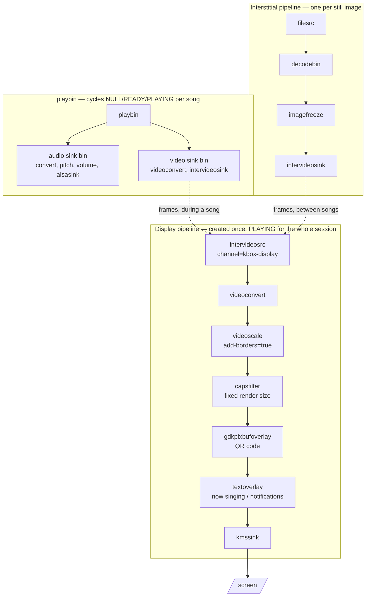

# The GStreamer Pipeline

How kbox gets audio and video onto a screen, why it is arranged this way, and
the things that look like they should work but do not.

Read this before changing anything in `kbox/streaming.py`. Most of the notes
below exist because something plausible was tried, shipped, and had to be
measured on real hardware before it became obvious it was wrong.

## The shape of it

Three pipelines, not one.



**The display pipeline owns the screen.** It goes to PLAYING once at startup
and stays there until the process exits. Nothing about a song change touches
it.

**playbin decodes songs** and renders into an `intervideosink`, which hands
buffers to the display pipeline's `intervideosrc` over a named channel. It is
free to cycle through NULL and READY as often as it likes.

**A separate pipeline feeds still images.** Interstitials (idle screen,
"up next", end of queue) are PNGs, and go through `imagefreeze` rather than
playbin.

playbin and the interstitial pipeline are **mutually exclusive** — each stops
the other before it starts feeding. If both fed the bridge at once, a song and
an interstitial would interleave on screen.

## How it used to work, and why it changed

The first generation put everything in one playbin:

```
playbin
  ├── audio-sink: audioconvert → pitch shift → volume → alsasink
  └── video-sink: videoconvert → overlays → videoscale → kmssink
```

Interstitials were played *through playbin* by pointing its `uri` at a PNG.

This had two visible faults, filed as
[#94](https://github.com/mdz/kbox/issues/94) and
[#93](https://github.com/mdz/kbox/issues/93):

**The console flashed between songs.** playbin owns whatever is set as its
`video-sink`, so every song change dragged kmssink through PAUSED→READY.
`GstBaseSink.stop()` runs on that transition, and for kmssink it closes the DRM
file descriptor — dropping DRM master and handing the screen back to the
kernel console, `getty` prompt and all.

The fix is the split above: the sink's *lifetime* has to be independent of the
content being played. Nothing else works, because the problem is not which
state playbin drops to (see the traps below).

**The console showed in the margins of non-16:9 videos.** kmssink scales to
fit *while preserving aspect*, so a 4:3 source on a 16:9 screen lands centred
with bars either side, and the console is what is underneath. The fix is to
letterbox the source into a frame that already carries the display's aspect
ratio, so the frame kmssink scales covers the screen.

## Why the render size is fixed and capped

The `capsfilter` after `videoscale` pins every frame to one size for the whole
session — the display's aspect ratio, capped at `MAX_RENDER_HEIGHT` (720).
Both halves of that matter.

**Fixed**, because kmssink allocates DRM framebuffers for one frame size and
cannot reallocate them when caps change underneath it. Letting the frame size
follow the source produces `failed to activate bufferpool`, then an internal
data stream error, then a pipeline that renders nothing at all while the
console sits on screen. Adding a `queue` does not help; the constraint is
kmssink's, not a threading problem.

**Capped**, because software scaling to the display's full resolution is too
expensive to keep up. Measured on a Pi 5, 640x360 source at 30fps:

| render size | cost | sustained frame rate |
|---|---|---|
| 1920x1080 | ~46 ms/frame | 23.6 fps — drops 21% of frames |
| 1280x720 | ~25 ms/frame | 30.0 fps |
| 960x540 | ~16 ms/frame | 30.0 fps |

Rendering smaller costs nothing in quality: kmssink's upscale is free, and
sources at or below the render height pass through `videoscale` untouched.
Raising the cap to the display's resolution reintroduces frame drops, so treat
it as load-bearing rather than a tuning preference.

## Overlays

The QR code and notification text are composited **after** the capsfilter, in
the fixed render frame:

- Its top-left corner is the screen's top-left, even when the video is inset
  between bars — so the QR sits in the bar rather than on top of the video.
- kmssink scales the whole frame by one factor, so anything sized as a
  *proportion* of the render frame is a constant size on screen.

Upstream of the scaler they would be drawn onto the source frame and magnified
along with it. A QR sized for a 1080p screen drawn on a 360-line video is
about 45% of its height, and stays that big once scaled up.

## Reducing the scaler's cost

The 360p→720p upscale (~25 ms/frame, see above) adds no information — it
exists purely so overlays land in a frame with enough resolution to stay
sharp. Four ways to cut that cost were investigated; measurements below are
all on a Pi 5, 640x360 @ 30fps unless noted.

**Shipped: `videoscale method=nearest-neighbour`.** Overlays are composited
*after* the capsfilter (see above), so the scaler's method only affects the
video itself, never overlay sharpness. Nearest-neighbour halves the upscale
cost against the bilinear default:

| method | scale-stage cost | total (incl. decode) |
|---|---|---|
| bilinear (previous default) | ~25 ms/frame | ~27 ms/frame |
| nearest-neighbour (shipped) | ~12 ms/frame | ~14 ms/frame |

Content has no detail beyond 360 lines to begin with, so nearest-neighbour's
blockiness is not expected to be visible at normal viewing distance. No
other trade-off was found — it's a one-property change.

**Considered: fetch and render at 720p, making `videoscale` a passthrough.**
Cheaper decode-plus-scale than expected, but decode is *not* free at 720p —
the Pi 5 has no H.264 hardware decoder (only an HEVC decode block,
`rpi-hevc-dec`), so 720p H.264 is software-decoded via `openh264dec`.
Measured with `filesrc ! decodebin ! fakesink`, same content re-encoded at
both sizes:

| source | decode cost | scale-stage cost (passthrough at 720p) | total |
|---|---|---|---|
| 640x360 (current) | ~1.9 ms/frame | ~25 ms/frame (upscale) | ~27 ms/frame |
| 1280x720 | ~8.1 ms/frame | ~10.9 ms/frame | ~19 ms/frame |

That 10.9 ms at "passthrough" is not zero — `videoconvert` and overlay
compositing both still cost more on a bigger frame, so this is a real but
smaller win than "decode is cheaper than upscaling" suggests on its own.

It is also not currently reachable in production: `kbox/ytdlp.py` requests
`bestvideo[height<={video_max_resolution}]`, but on this deployment's yt-dlp,
YouTube's DASH formats above 360p require a JS-runtime-based signature/PO
token solver that isn't installed. Tested across `android`, `web`, `tv`, and
`web_safari` player clients — all fell back to the legacy progressive 360p
stream regardless of the configured cap. Raising `video_max_resolution` to
720 would silently do nothing today; making it work is a yt-dlp/JS-runtime
dependency question, unrelated to the pipeline itself. Worth revisiting if
that gets fixed, since it would also raise the picture's actual detail.

**Deferred: V4L2 M2M hardware scaler (`pispbe`).** Mapping the devices into
the container is trivial (`--device=/dev/video*` in `docker-compose.yml`,
not currently there) — the real question is what's behind them, and that
turned out more capable than a first pass suggested. `pispbe`
(`platform:1000880000.pisp_be`, `/dev/video20`–`/dev/video27`) is the Pi 5
ISP backend, and `media-ctl -d /dev/media1 -p` shows it as a genuine
general-purpose engine: one input node (`pispbe-input`, a plain V4L2
*output*-multiplanar queue any source can write YUV into, not
camera-specific) feeds a subdev that produces **two independently-sized**
capture nodes (`pispbe-output0`, `pispbe-output1`) — exactly the "scale to
one size for overlays, keep the other at source res" shape this problem
wants, and in hardware. `libpisp1` and the kernel UAPI headers
(`pisp_be_config.h`) are installed on the host, so the config-buffer format
libcamera uses to drive it is available without reverse-engineering.

What's missing is any GStreamer glue. `GST_DEBUG=v4l2:5 gst-inspect-1.0
video4linux2` shows the plugin *does* dynamically probe `/dev/video*` for
M2M devices — it found and registered `v4l2slh265dec` against
`rpi-hevc-dec` this way — but it explicitly skips `pispbe`'s nodes. That
tracks: `rpi-hevc-dec` is a single-node stateless-codec M2M device, the
shape GStreamer's v4l2 plugin knows how to drive. `pispbe` is a
multi-node, media-controller-linked device that also needs a per-frame
config buffer pushed through a seventh node (`pispbe-config`,
`/dev/video27`) — a different, more involved protocol with no existing
GStreamer element on either side of it.

Net: the hardware is real and well-suited to this problem, but using it
means writing a new element (media-ctl link setup at startup, libpisp-driven
config construction per frame, multi-plane buffer queuing across the input/
config/output nodes, ideally DMA-BUF-shared with `decodebin`'s output to
stay zero-copy) rather than configuring one that exists. That's a
substantial, undocumented-territory systems project — bigger than the DRM
plane option below, not a quick win. Worth a dedicated follow-up if a future
need for hardware scaling outgrows what nearest-neighbour buys; not
attempted in this pass.

**Deferred: overlays on their own DRM plane.** `kmssink` takes a `plane-id`
property, and the Pi has spare planes free at runtime (checked via
`/sys/kernel/debug/dri/*/state` — the video currently claims one plane,
several more sit unused). Moving overlays to a second plane would decouple
overlay sharpness from render size, unlocking a 360p render (video-only
scale-stage cost ~2.7 ms/frame, passthrough) without softening the QR or
text. This is real headroom, but it means a second sink/pipeline and
plane-level compositing — the highest-complexity option here, and not
attempted in this pass. Worth a dedicated follow-up if the nearest-neighbour
change turns out not to be enough.

## Measuring changes

The display pipeline is on the hot path for every frame.
`test/test_pipeline_benchmark.py` measures the stages, building its pipelines
from the same `StreamingController` methods the app uses (see the file's
docstring) so it can't quietly drift from what actually runs:

```bash
# on the Pi, inside the container — the only numbers that mean anything
docker-compose exec kbox python3 -m pytest test/test_pipeline_benchmark.py -m benchmark -s

# on a macOS dev machine
uv run pytest test/test_pipeline_benchmark.py -m benchmark -s

# run it directly for custom sizes, framerates, or a longer audio run
uv run python test/test_pipeline_benchmark.py --source 640x480 --screen 1920x1080 --fps 25
```

Its headline metric is the frame rate a configuration could sustain, not CPU
percentage, and that choice is deliberate — see the trap about it below.

## Traps

Each of these cost at least one round of deploy-and-look-at-the-screen.

### NULL versus READY makes no difference to the sink

`GstBaseSink.stop()` runs on the **PAUSED→READY** transition, not on NULL. A
sink inside playbin is torn down either way, so dropping to READY instead of
NULL to "keep the sink alive" does nothing at all. The sink's lifetime is what
matters, which is why it lives in its own pipeline.

### NULL versus READY also makes no difference to format renegotiation

`load_file()` used to drop `playbin` all the way to NULL before swapping `uri`, on the
theory that READY would leave the internal `uridecodebin` graph (demuxer, decoder)
wired for the old file's format and risk a bad renegotiation on the next song. That
turned out to be inherited habit from the original per-song pipeline design, predating
the persistent-`playbin` refactor (`git log -S` traces the NULL call to the WIP commit
that introduced the persistent pipeline) — not something chosen for a specific reason
at the time.

Tested directly: cycled one `playbin` between two on-disk files with deliberately
mismatched containers, codecs, resolutions, framerates, sample rates and channel counts
(h264/aac, 320x240, 30fps, in mp4 vs. vp8/vorbis mono, 640x480, 25fps, in webm),
swapping `uri` and going back to PLAYING from both READY and NULL, several cycles each.
Every transition succeeded, no bus errors either way — `uridecodebin` rebuilds its
dynamic element graph on a `uri` change regardless of which state it dropped from.

(Tested on macOS with `autoaudiosink`/`autovideosink`, not `alsasink`/`kmssink` on the
Pi.) On that basis `load_file()` now drops to READY instead of NULL — cheaper, and
matches `stop_playback()`. This is flagged for the next pre-release burn-in pass:
watch specifically for anything on song transitions between very different source
formats (resolution, codec, channel layout) that didn't happen before this change.

### `intervideosrc`'s `timeout` does not hold the last frame

Its description — *"Timeout after which to start outputting black frames"* —
reads like a hold duration. It is not. Measured hold length is identical at
1 second, 5 seconds and a year: `intervideosrc` serves a received buffer a
couple of times and then generates black regardless. The property governs
waiting for a *first* buffer.

Consequence: **something must keep feeding the bridge** or the screen goes
black. That is the entire reason interstitials have their own `imagefreeze`
pipeline.

### playbin does not insert `imagefreeze` for still images

A still image decoded on its own yields one buffer and then EOS. Playing a PNG
through playbin therefore starves anything downstream.

This worked in the first generation only by accident: kmssink was inside
playbin and went on scanning out its last framebuffer after EOS. That
persistence disappeared the moment the sink moved to its own pipeline, and the
idle screen started blanking to black a second after every stop.

### `inter` elements only pair up inside one process

`intervideosink` and `intervideosrc` find each other through a process-global
registry. Two separate `gst-launch-1.0` processes **never connect** — both
pipelines run happily and exit 0, the receiver quietly emitting black frames
the whole time.

Any test of the bridge has to build both pipelines in a single process.
Otherwise it will appear to pass while testing nothing.

### kmssink already scales in hardware

It is easy to assume the sink needs to be handed screen-sized frames. It does
not. With plain defaults on a Pi 5 (`vc4-drm`), given a 640x360 frame on a
1920x1080 screen, kmssink logs:

```
drmModeSetPlane at (0,0) 1920x1080 sourcing at (0,0) 640x360
```

Upscaling in software before the sink duplicates work the display controller
does for free, at ~46 ms/frame. Only the *aspect ratio* of the frame needs
fixing, not its resolution.

Useful when investigating: `GST_DEBUG=kmssink:7` prints the plane rectangle it
actually programs, which beats guessing from what the screen looks like.

### `textoverlay` already scales its own font

`auto-resize` is on by default and scales the font relative to a 640-pixel-wide
frame. Setting a font size derived from the display scales it a second time —
on a 1080p screen that turned `Sans 9` into roughly 66pt of text across most of
the width.

Leave the font alone and let `auto-resize` do it. `xpad`/`ypad` are raw pixels
that `auto-resize` does *not* touch, so those do need scaling by hand.

### CPU percentage hides frame drops

A configuration that cannot keep up does not report 100% CPU — it drops frames
and reports something comfortable. This branch sat at ~52% while dropping a
fifth of its frames, and the deficit was invisible on screen because karaoke
content is mostly a lyric highlight sweeping over a low-detail background.

Measure sustained frame rate, not CPU share. Count buffers reaching the sink
against a realtime clock over a fixed interval.

### The display pipeline needs its own bus watch

It is a separate `GstPipeline`, so it has a separate bus. Without a watch on
it, a failure is completely silent: the app logs a clean startup, every
component reports success, and the screen shows the console. There is a watch
on it now — do not remove it.

## Running the GStreamer tests

The pipeline tests are marked `gstreamer` and deselected by default (see
`addopts` in `pyproject.toml`).

```bash
# on a macOS dev machine
uv run pytest -m gstreamer

# on the Pi, inside the container
docker-compose exec kbox python3 -m pytest -m gstreamer
```

macOS needs PyGObject, which is declared as a dev dependency for
`sys_platform == 'darwin'` only — Linux and the Docker image use the system
`python3-gi` package instead. If `import gi` fails, run `uv sync --group dev`.

`test/test_streaming.py` and `test/test_pipeline_benchmark.py` both call
`configure_macos_gstreamer_env()` (in `kbox/platform.py`) before importing
`gi`, which pins everything to the Homebrew GStreamer — the same helper
`kbox/main.py` uses to run the app itself on macOS. A Mac can easily end up
with both that and the official `GStreamer.framework` from the binary
installer, and mixing libraries from one with plugins from the other fails in
confusing ways — so the setup requires `brew --prefix glib gstreamer` to
resolve and raises a clear error instead of silently falling through to
whatever `import gi` happens to find.

These tests cover pipeline *structure*, not hardware behaviour. macOS has no
`kmssink`, so anything involving the console, plane scaling or mode reporting
can only be verified on a Pi.
